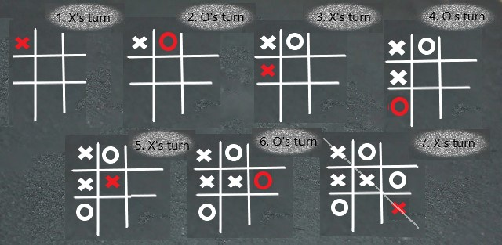

# How to play Tic Tac Toe

## In this article

If you're looking for an relative easy pastime and don't want to get sweat, stressed, or broke, you're in the right place. In this article, you'll learn how to play Tic Tac Toe. You'll find out what you need to start, what rules to follow, and how to maximize your chances for winning.

## About Tic Tac Toe

Tic-Tac-Toe (aka *noughts and crosses* or *Xs and Os*) is a paper-and-pencil game that requires two players to take turns filling in the fields in the 3x3 grid with Xs or Os. The winner is a player who puts down three same marks in a horizontal, vertical, or diagonal row. There are a number of Tic-Tac-Toe variants, such as Ultimate Tic Tac Toe, 3D Tic Tac Toe, or Wild Tic Tac Toe.

## Before you start

### Find and prepare

* Find one person to play with.
* Prepare a pensil (or something else you can use for putting down X/O marks on the board) and a piece of paper (or something that you can use for drawing your grid and marks).

### Decide and select

With the other player, decide

* What mark (X or O) initiates the game
* Who of you is going to use X and who is going to use O.

## Let's play

### Rules of the game

Here are Tic-Tac-Toe player's actions:

1. Let a player who selected the game-initiating mark start (as [agreed before the game](#decide-and-select).
2. When your turn comes, mark an empty field of your choice in the grid with your selected symbol (X or O).
3. Iterate step 2 until one of you puts down the third same symbol in a row (horizontal, vertical, or diagonal), which means he/she wins.

> As a winner, cross out the lucky row, stampling the grid as closed.

#### Check out a sample round

## Game over

The game can complete with a win/lose or a draw.

> Tic-Tac-Toe is a solved game: It's possible to predict a draw if both players follow best possible playing scenarions.

## Tips and tricks

* The is no clear guidance on the optiaml game strategy.
* You can discover your best playing scenarion shortly just playing along.

## Play on

If you enjoy playing Tic-Tac-Toe, it's likely you'll also like other paper-and-pensil games, such as

* [Sprouts](https://en.wikipedia.org/wiki/Sprouts_(game))
* [Dots and Boxes](https://en.wikipedia.org/wiki/Dots_and_Boxes)

Check them out!
