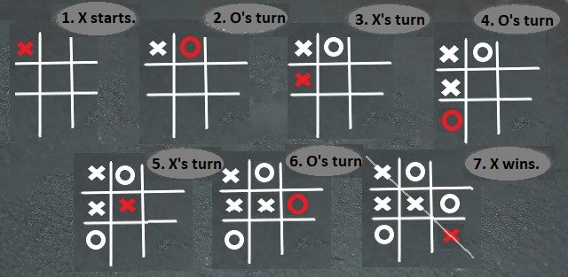

# How to play Tic-tac-toe

## In this article

If you're looking for an relative easy pastime and don't want to get sweat, stressed, or broke, you're in the right place. In this article, you'll learn how to play Tic-tac-toe. You'll find out what you need to start, what rules to follow, and how to maximize your chances for winning.

CONTENTS
>[About Tic-tac-toe](#about-tic-tac-toe) 
>[Before you start](#before-you-start) 
>[Rules of the game](#rules-of-the-game) 
>[Sample round](#sample-round) 
>[Tips and tricks](#tips-and-tricks) 
>[Play on](#play-on) 

## About Tic-tac-toe

Tic-tac-toe (aka *noughts and crosses* or *Xs and Os*) is a pen-and-paper game that requires two players taking turns filling in the fields in the 3x3 grid with Xs or Os. The winner is a player who puts down three same marks in a horizontal, vertical, or diagonal row. There are a number of Tic-tac-toe variants, such as [Ultimate Tic-tac-toe](https://en.wikipedia.org/wiki/Ultimate_tic-tac-toe), [3D Tic-tac-toe](https://en.wikipedia.org/wiki/3D_tic-tac-toe), or [Wild Tic-tac-toe](https://en.wikipedia.org/wiki/Wild_tic-tac-toe).

## Before you start

### Find and prepare

* Find one person to play with.
* Prepare a pensil (or something else you can use for putting down X/O marks on the board) and a piece of paper (or something that you can use for drawing your grid and marks).

### Decide and select

With the other player, decide

* What mark (X or O) initiates the first game
* Who of you is going to use X and who is going to use O.

Let's play!

## Rules of the game

### Player's actions

1. Player who selected the game-initiating mark (as [agreed before the game](#decide-and-select)) starts by drawing a grid and putting down the first mark.
2. Players take turns marking empty fields in the grid with their selected symbols (Xs or Os).
3. Players iterate step 2 until the end of the round, which is when either

   * One of the players [wins](#end-of-the-game) by putting down the third same symbol in a row (horizontal, vertical, or diagonal) and crossing it out to stamp the grid as closed
     
     OR
     
   * There are no more free spaces in the grid, which mean a [draw](#end-of-the-game).

4. Before the players start another game, they rotate the initiating mark so that the same player does not start two consecutive games.
5. Players iterate steps 1 - 4 as long as they feel like playing.

### End of the game

The game can complete with a win/lose or a draw.

> Tic-tac-toe is a solved game: It's possible to predict a draw if both players follow best possible playing scenarios.

## Sample round

Check out an example game.

## Tips and tricks

* Just play along: You will discover your best playing scenarios shortly.
* You can increase you chances to win the game if you're the one who starts.
* When deciding where to place your mark and not able to find a 3-same-mark-row option, at least try to prevent the other player from winnig by blocking their three-same-mark rows, if any. You can do that by placing your mark next to two same consecutive marks of the other player.

## Play on

If you enjoy playing Tic-tac-toe, it's likely you'll also like other pen-and-paper games, such as

* [Sprouts](https://en.wikipedia.org/wiki/Sprouts_(game))
* [Dots and Boxes](https://en.wikipedia.org/wiki/Dots_and_Boxes)

Check them out!
